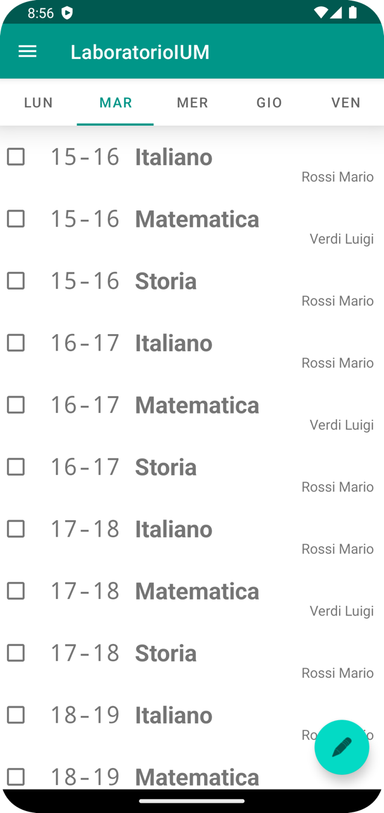
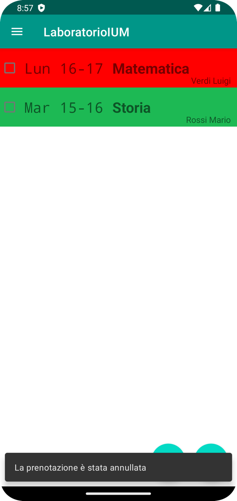
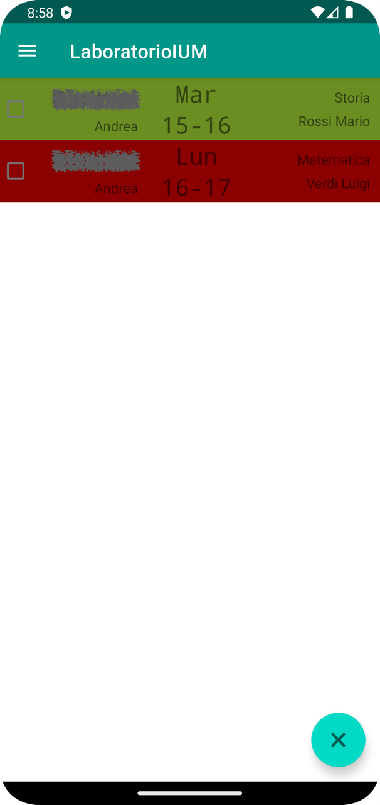

# Booking App for Private Lessons
### Laboratorio IUM A.A. 2021/2022
University project that consist in a Java Servlet, a WebApp in Vue.js and this Android App
The project is a completly working app that allows you to book private lessons.

## Screenshots
### User
<table>
  <tr>
    <td>
      
    </td>
    <td>
      
    </td>
  </tr>
  <tr>
    <td>
      
    </td>
    <td>
      
    </td>
  </tr>
</table>

### Root
<table>
  <tr>
    <td>
      
    </td>
    <td>
      
    </td>
  </tr>
  <tr>
    <td>
      
    </td>
    <td>
      
    </td>
  </tr>
</table>

